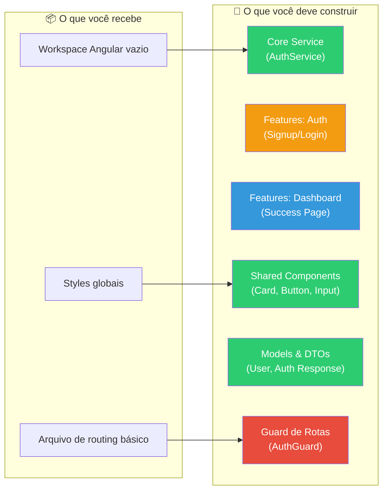
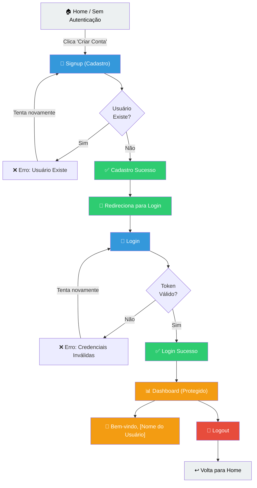

# Exercício: Flow de Autenticação (Cadastro → Login → Sucesso)

**Duração estimada**: 90min  
**Objetivo**: Aplicar arquitetura em camadas, componentes Smart/Dumb, lazy loading e comunicação entre componentes em um fluxo real.

---

## 📊 Visão Geral do Exercício



---

## O que já vem pronto

- ✅ Workspace Angular standalone
- ✅ `app.routes.ts` básico (será expandido)
- ✅ `app.component.ts` com RouterOutlet
- ✅ `styles.css` global
- ✅ Estrutura de pastas vazia
- ✅ `formsModule` disponível no package.json

---

## Fluxo da Aplicação



---

## Estrutura Esperada (Final)

```
src/app/
├── core/
│   ├── services/
│   │   ├── auth.service.ts              ← Gerencia autenticação
│   │   └── storage.service.ts           ← Persiste token em localStorage
│   ├── guards/
│   │   └── auth.guard.ts                ← Protege rotas
│   └── models/
│       └── user.model.ts                ← Tipos (User, LoginRequest, etc)
│
├── shared/
│   ├── components/
│   │   ├── card/
│   │   │   ├── card.component.ts
│   │   │   └── card.component.css
│   │   ├── button/
│   │   │   ├── button.component.ts
│   │   │   └── button.component.css
│   │   └── input/
│   │       ├── input.component.ts
│   │       └── input.component.css
│   └── pipes/
│       └── safe.pipe.ts                 ← Para sanitizar HTML (se necessário)
│
├── features/
│   ├── auth/
│   │   ├── containers/
│   │   │   ├── signup-container/        ← Smart Component
│   │   │   │   ├── signup-container.component.ts
│   │   │   │   └── signup-container.component.html
│   │   │   └── login-container/         ← Smart Component
│   │   │       ├── login-container.component.ts
│   │   │       └── login-container.component.html
│   │   ├── components/
│   │   │   ├── signup-form/             ← Dumb Component
│   │   │   │   ├── signup-form.component.ts
│   │   │   │   └── signup-form.component.html
│   │   │   └── login-form/              ← Dumb Component
│   │   │       ├── login-form.component.ts
│   │   │       └── login-form.component.html
│   │   ├── services/
│   │   │   └── auth-ui.service.ts       ← UI State (loading, errors)
│   │   ├── models/
│   │   │   └── auth-dto.model.ts        ← DTOs da feature
│   │   └── auth.routes.ts
│   │
│   └── dashboard/
│       ├── containers/
│       │   └── dashboard-container/     ← Smart Component
│       │       ├── dashboard-container.component.ts
│       │       └── dashboard-container.component.html
│       ├── components/
│       │   └── welcome-card/            ← Dumb Component
│       │       ├── welcome-card.component.ts
│       │       └── welcome-card.component.html
│       ├── services/
│       │   └── dashboard.service.ts
│       └── dashboard.routes.ts
│
├── app.component.ts
├── app.routes.ts                        ← Routing Principal
└── app.config.ts
```

---

## TODOs (implemente na ordem!)

### **TODO 1: Criar Models e DTOs** ⭐ Fácil — 10min
**O quê?** Definir interfaces de tipos para User, Auth Request/Response  
**Por quê?** Tipagem forte do TypeScript  
**Onde?** `core/models/user.model.ts`

```typescript
// Crie interfaces para:
// - User (id, email, name, createdAt)
// - SignupRequest (email, name, password)
// - LoginRequest (email, password)
// - AuthResponse (user: User, token: string)
// - AuthError (message: string, code: string)
```

---

### **TODO 2: Criar AuthService** ⭐⭐ Médio — 15min
**O quê?** Service central que gerencia autenticação  
**Por quê?** Camada de negócio isolada  
**Onde?** `core/services/auth.service.ts`

```typescript
// Implemente:
// 1. signup(email, name, password): Observable<AuthResponse>
//    - Simule uma chamada HTTP (use delay do RxJS)
//    - Valide: email não pode estar vazio, nome min 3 chars
//    - Se email "admin@test.com" → erro: "Usuário já existe"
//    - Se válido → retornar AuthResponse com token fictício
//
// 2. login(email, password): Observable<AuthResponse>
//    - Valide: email e password obrigatórios
//    - Se email "user@test.com" e password "123456" → sucesso
//    - Se não → erro: "Email ou senha inválidos"
//    - Retornar AuthResponse com token fictício
//
// 3. getCurrentUser(): Observable<User | null>
//    - Retorna o user do localStorage ou null
//
// 4. isAuthenticated(): Observable<boolean>
//    - Retorna true se há token no localStorage
//
// 5. logout(): void
//    - Remove token do localStorage
```

---

### **TODO 3: Criar StorageService** ⭐ Fácil — 10min
**O quê?** Service para persistir dados (token, user)  
**Onde?** `core/services/storage.service.ts`

```typescript
// Métodos:
// - setToken(token: string): void
// - getToken(): string | null
// - removeToken(): void
// - setUser(user: User): void
// - getUser(): User | null
// - removeUser(): void
// - clear(): void
```

---

### **TODO 4: Criar AuthGuard** ⭐ Fácil — 10min
**O quê?** Guard que protege rotas autenticadas  
**Onde?** `core/guards/auth.guard.ts`

```typescript
// Implemente CanActivateFn que:
// 1. Verifica se há token no StorageService
// 2. Se tem → permite acesso (return true)
// 3. Se não tem → redireciona para /auth/login (Inject Router)
```

---

### **TODO 5: Criar Shared Components** ⭐⭐ Médio — 20min
**O quê?** Componentes reutilizáveis (Card, Button, Input)  
**Onde?** `shared/components/`

```typescript
// Card Component (Dumb)
// - @Input() title: string
// - @Input() subtitle?: string
// - <ng-content> para conteúdo interno

// Button Component (Dumb)
// - @Input() label: string
// - @Input() loading: boolean = false
// - @Input() disabled: boolean = false
// - @Output() click = new EventEmitter<void>()

// Input Component (Dumb)
// - @Input() label: string
// - @Input() type: 'email' | 'password' | 'text' = 'text'
// - @Input() value: string = ''
// - @Input() errorMessage?: string
// - @Output() change = new EventEmitter<string>()
```

---

### **TODO 6: Criar Auth Feature (Signup)** ⭐⭐ Médio — 20min
**O quê?** Página de cadastro com componentes Smart/Dumb  
**Onde?** `features/auth/containers/` e `features/auth/components/`

```typescript
// SignupFormComponent (Dumb - Presentation)
// - @Input() loading: boolean
// - @Input() error?: string
// - @Output() submit = new EventEmitter<SignupRequest>()
// - Form reativo com: email, name, password, passwordConfirm
// - Validações: obrigatórios, email format, password min 6 chars

// SignupContainerComponent (Smart)
// - Injeta AuthService e Router
// - Gerencia loading$ e error$ (BehaviorSubject)
// - onSubmit() chama authService.signup()
//   - Se sucesso → mostra mensagem e redireciona para /auth/login
//   - Se erro → exibe error$ no FormComponent
```

---

### **TODO 7: Criar Auth Feature (Login)** ⭐⭐ Médio — 20min
**O quê?** Página de login  
**Onde?** `features/auth/containers/` e `features/auth/components/`

```typescript
// LoginFormComponent (Dumb - Presentation)
// - @Input() loading: boolean
// - @Input() error?: string
// - @Output() submit = new EventEmitter<LoginRequest>()
// - Form reativo com: email, password
// - Link "Não tem conta? Cadastre-se" → /auth/signup

// LoginContainerComponent (Smart)
// - Injeta AuthService, StorageService, Router
// - Gerencia loading$ e error$
// - onSubmit() chama authService.login()
//   - Se sucesso → salva token + user no StorageService
//   - Redireciona para /dashboard
//   - Se erro → exibe error$
```

---

### **TODO 8: Criar Dashboard Feature** ⭐ Fácil — 15min
**O quê?** Página protegida com mensagem de boas-vindas  
**Onde?** `features/dashboard/`

```typescript
// WelcomeCardComponent (Dumb)
// - @Input() userName: string
// - @Output() logout = new EventEmitter<void>()
// - Exibe: "Bem-vindo, {userName}!"
// - Botão "Logout"

// DashboardContainerComponent (Smart)
// - Injeta AuthService, StorageService, Router
// - Carrega currentUser$ = authService.getCurrentUser()
// - onLogout() → authService.logout()
//   → Remove dados do StorageService
//   → Redireciona para /auth/login
```

---

### **TODO 9: Configurar Routing** ⭐ Fácil — 10min
**O quê?** Estruturar rotas com lazy loading  
**Onde?** `app.routes.ts` e `features/auth/auth.routes.ts`, `features/dashboard/dashboard.routes.ts`

```typescript
// app.routes.ts
// - '' → redirect para /auth/signup
// - 'auth' → lazy load auth.routes.ts
// - 'dashboard' → lazy load dashboard.routes.ts (com canActivate: [authGuard])
// - '**' → redirect para /auth/signup

// features/auth/auth.routes.ts
// - 'signup' → SignupContainerComponent
// - 'login' → LoginContainerComponent

// features/dashboard/dashboard.routes.ts
// - '' → DashboardContainerComponent
```

---

### **TODO 10: Integrações Finais** ⭐⭐ Médio — 10min
**O quê?** Conectar tudo: importações, providedIn, standalone  
**Onde?** Vários arquivos

```typescript
// Certificar-se de:
// 1. Todos os componentes e serviços têm standalone: true (ou providedIn: 'root')
// 2. FormModule é importado nos componentes com forms
// 3. CommonModule é importado nos componentes com *ngIf, *ngFor
// 4. Componentes Dumb importam Shared Components
// 5. Containers importam Components Dumb
// 6. app.config.ts importa providers (se necessário)
```

---

## ⏱️ Tempo sugerido por TODO

| TODO | Tarefa | Tempo | Dificuldade | Conceito |
|:----:|--------|:-----:|:-----------:|----------|
| 1 | Models e DTOs | 10min | ⭐ | Tipagem TypeScript |
| 2 | AuthService | 15min | ⭐⭐ | Services, RxJS delay, Observables |
| 3 | StorageService | 10min | ⭐ | localStorage API |
| 4 | AuthGuard | 10min | ⭐ | Route Guards, CanActivateFn |
| 5 | Shared Components | 20min | ⭐⭐ | @Input, @Output, Presentational |
| 6 | Signup Feature | 20min | ⭐⭐ | Form Reativo, Smart/Dumb, BehaviorSubject |
| 7 | Login Feature | 20min | ⭐⭐ | Form Reativo, Error Handling |
| 8 | Dashboard Feature | 15min | ⭐ | Signal ou Observable, Protected Routes |
| 9 | Routing | 10min | ⭐ | lazy loading, canActivate, redirectTo |
| 10 | Integrações | 10min | ⭐ | Imports, providers, standalone |
| **Total** | | **140min** | | |

---

## 🧪 Como Validar seu Trabalho

### Fluxo de testes:

```
1. npm start
   ↓
2. Abre http://localhost:4200
   ↓
3. Vê página de Signup
   ↓
4. Preenche e tenta cadastrar com email "admin@test.com"
   → ❌ Deve exibir: "Usuário já existe"
   ↓
5. Preenche com email novo e cadastra
   → ✅ "Cadastro realizado com sucesso!"
   → Redireciona para /auth/login
   ↓
6. Clica "Não tem conta? Cadastre-se"
   → Volta para signup
   ↓
7. Faz login com email "user@test.com" / senha "123456"
   → ✅ Redireciona para /dashboard
   ↓
8. Vê "Bem-vindo, [Nome do Usuário]"
   ↓
9. Clica Logout
   → ✅ Remove token do localStorage
   → Redireciona para /auth/login
   ↓
10. Tenta acessar /dashboard sem token
    → ❌ AuthGuard bloqueia
    → Redireciona para /auth/login
```

### Checklist:

- [ ] Signup valida email duplicado
- [ ] Signup valida campos obrigatórios
- [ ] Login aceita credenciais "user@test.com" / "123456"
- [ ] Token é salvo no localStorage após login bem-sucedido
- [ ] Dashboard exibe nome do usuário
- [ ] Logout remove token e redireciona
- [ ] AuthGuard protege /dashboard
- [ ] Lazy loading funciona (vê no DevTools → Network → JS chunks)
- [ ] Navegação entre signup/login funciona
- [ ] Nenhum erro no console

---

## 💡 Dicas

### Se travar em algum TODO:

| TODO | Se não souber... | Dica |
|------|------------------|------|
| 2 | Como fazer delay no Observable | Use `of(data).pipe(delay(500))` do RxJS |
| 5 | Como passar @Input para atributo | Use `[value]="inputValue"` e binding bidirecional |
| 6 | Como gerenciar estado de loading | Combine `BehaviorSubject` + `.pipe(tap())` |
| 9 | Como fazer lazy loading | Use `loadChildren: () => import(...)` |
| 10 | Como importar corretamente | Procure por importações em componentes já existentes |

### Problemas comuns:

**❌ Erro: "Can't resolve '@angular/forms'"**
- Solução: Faça o import no arquivo: `import { ReactiveFormsModule } from '@angular/forms';`

**❌ Components não aparecem**
- Solução: Verificar se está em `imports: []` do componente pai

**❌ AuthGuard não redireciona**
- Solução: Verificar se retorna `true`, `false` ou `redirect()` corretamente

**❌ Token não persiste ao recarregar**
- Solução: StorageService deve usar `localStorage.getItem()` no método getToken()

---

## 📚 Referências da Arquitetura

```
Padrões aplicados neste exercício:

1. ✅ Arquitetura em Camadas
   - Core: AuthService, StorageService, AuthGuard
   - Features: Auth (Signup/Login), Dashboard
   - Shared: Card, Button, Input

2. ✅ Smart/Dumb Components
   - Smart (Containers): gerenciam estado, chamam services
   - Dumb (Components): recebem @Input, emitem @Output

3. ✅ Lazy Loading
   - Auth feature carrega apenas quando necessário
   - Dashboard feature também em lazy loading

4. ✅ Observable Pattern
   - loading$: BehaviorSubject<boolean>
   - error$: BehaviorSubject<string | null>
   - Comunicação via Observables

5. ✅ Guards e Proteção de Rotas
   - AuthGuard valida token antes de acessar /dashboard

6. ✅ Separação de Responsabilidades
   - Services: lógica de negócio
   - Components: apresentação
   - Models: tipos
```

---

## 🎓 Conceitos para Preparar

Antes de começar, revise:

- [ ] **RxJS Operators**: `of()`, `delay()`, `tap()`, `map()`, `catchError()`
- [ ] **Reactive Forms**: `FormBuilder`, `FormControl`, `Validators`
- [ ] **Angular Routing**: `loadChildren`, `canActivate`, `Router.navigate()`
- [ ] **Dependency Injection**: `providedIn: 'root'`, `inject()`
- [ ] **TypeScript**: Interfaces, tipos genéricos

---

## 🚀 Próximos Passos (Depois do Exercício)

- [ ] Integrar com API real (não simulada)
- [ ] Adicionar interceptor para injetar token em requisições
- [ ] Implementar refresh token
- [ ] Adicionar loading spinners globais
- [ ] Testes unitários (Jasmine) para services

---

**Boa sorte! 💪 Foco em entender a arquitetura, não em "terminar rápido".**
